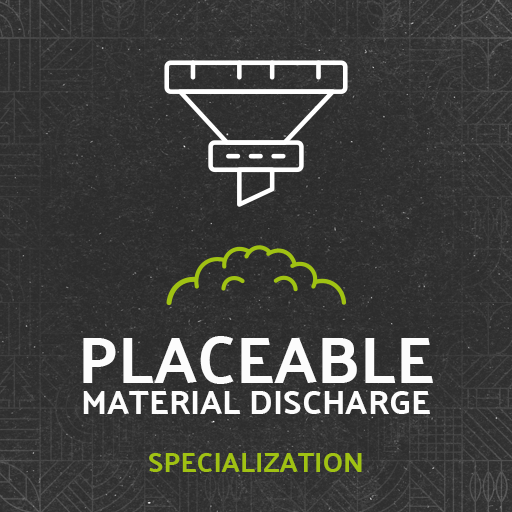
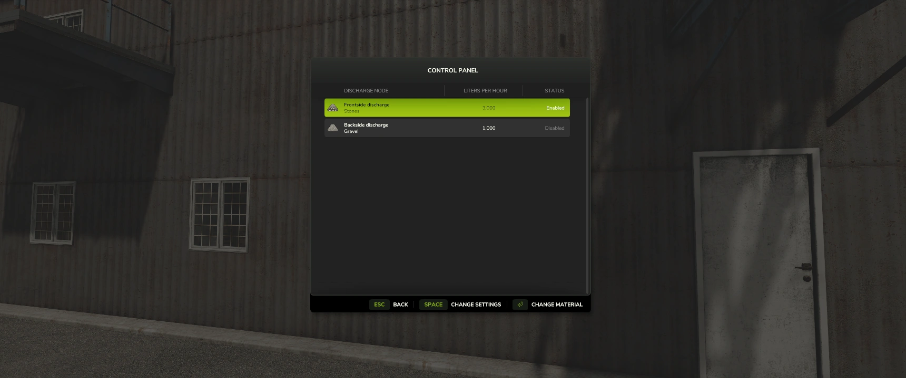
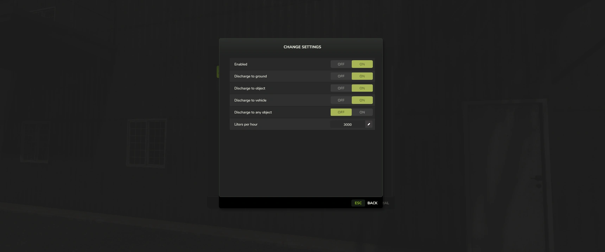
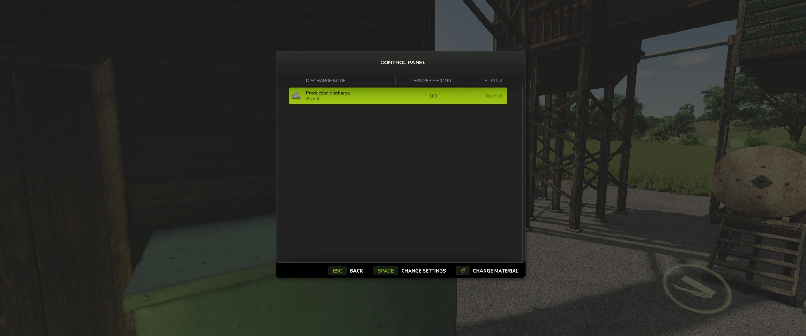
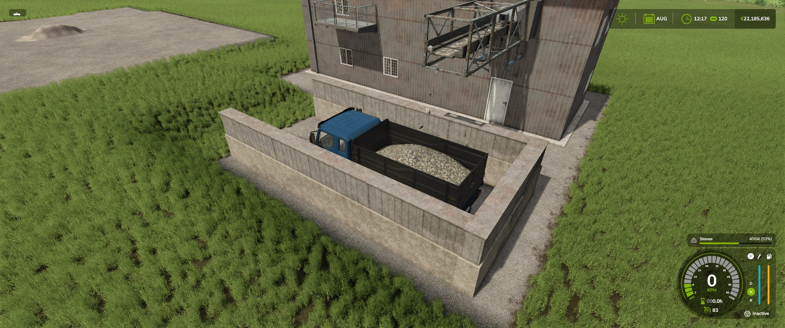

# Placeable Material Discharge

Specializations for placeables to enchance functionality for modders.

```
author: scfmod
url:    https://github.com/scfmod/FS25_PlaceableMaterialDischarge

If you distribute this mod, always include this info.

AND DO NOT UPLOAD IT TO MONETARY UPLOAD SERVICES.
THIS CODE IS AVAILABLE TO ANYONE FOR FREE AND YOU CAN USE
IT TO LEARN, FORK AND SPREAD THE KNOWLEDGE.
```

## Specializations

#### - ```productionDischargeable```

Discharge fill type(s) from production point. [Read more here.](./docs/PRODUCTION_DISCHARGEABLE.md)

#### - ```materialDischargeable```

Generate fill type(s) and discharge. [Read more here.](./docs/MATERIAL_DISCHARGEABLE.md)

## How to download and install

Download the latest [```FS25_0_PlaceableMaterialDischarge.zip```](https://github.com/scfmod/FS25_PlaceableMaterialDischarge/releases/latest/download/FS25_0_PlaceableMaterialDischarge.zip) and copy/move it into your FS25 mods folder.

## Multiplayer

Multiplayer is fully supported.


## Images








